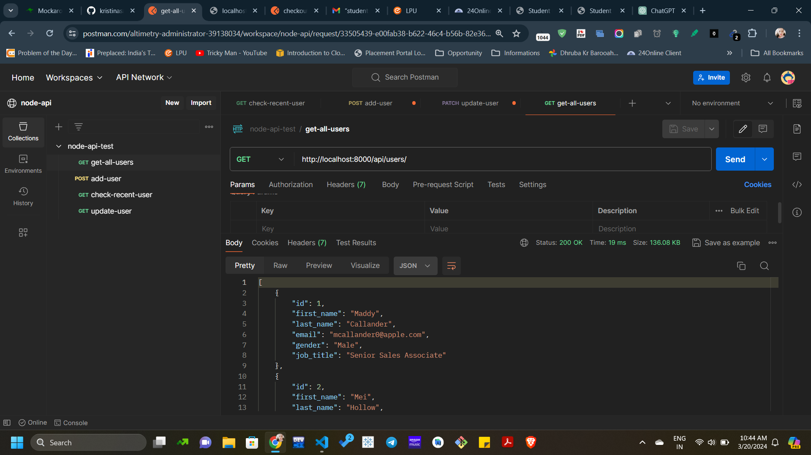
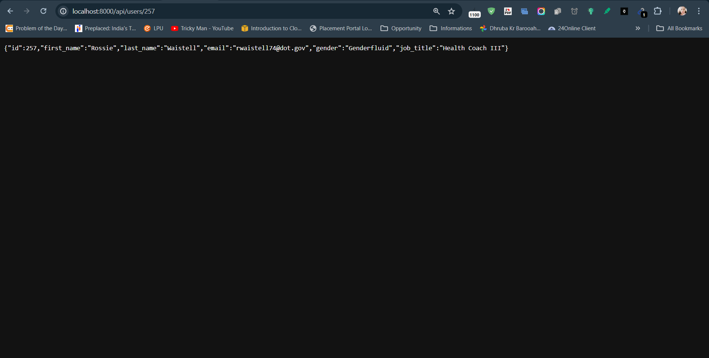
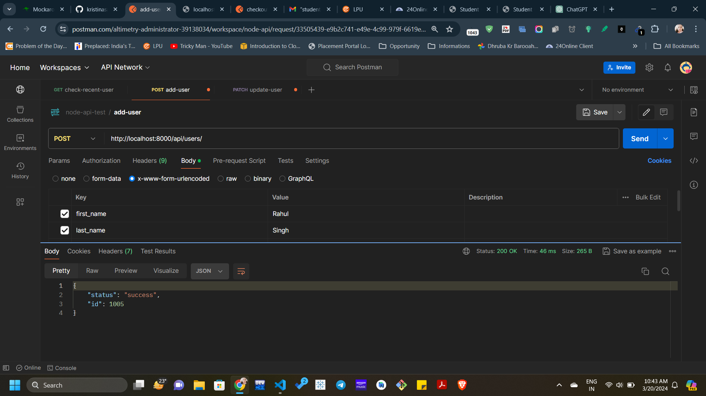
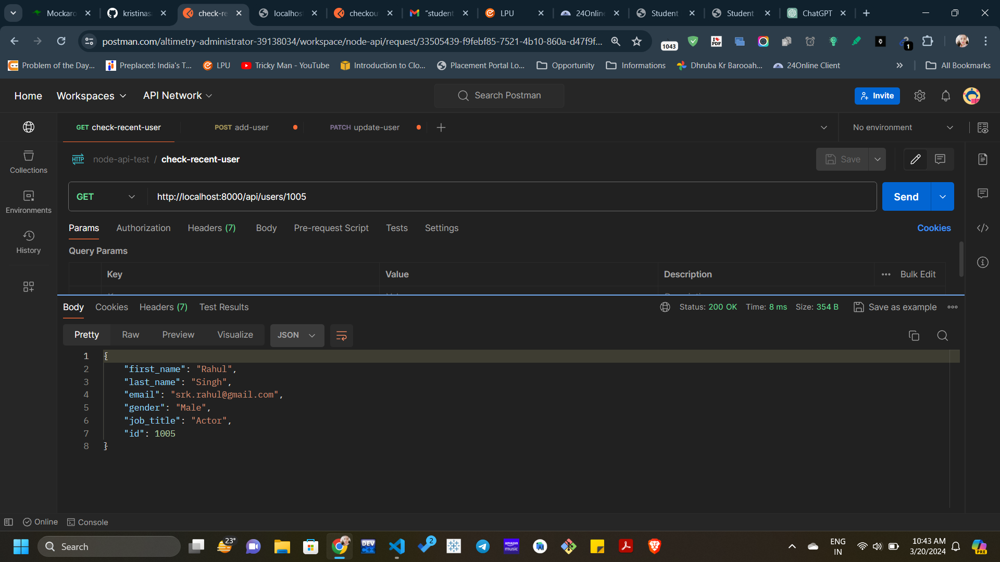

# node-rest-api
building a REST API - which supports JSON

This API supports the following routes

GET /users - HTML Document Render
GET /api/users - List all users JSON

GET /user/1 - Get the user with ID=1
GET /user/2 - Get the user with ID=2
so, the basic syntax will be : 
GET /user/:id - to get user with any required id
:id means variable | Dynamic
This called Dynamic Path Parameter
 

POST /users - Create new user

PATCH /users/1 - Edit the user with ID 1

DELETE /users/1 - Delete the User with ID 1
